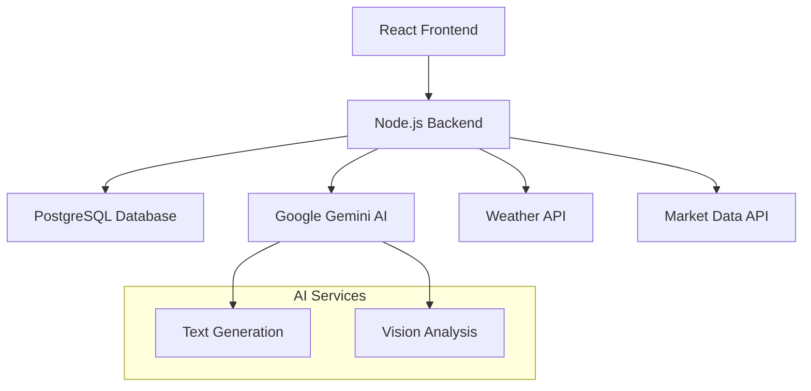

# 🌾 AgroAI - Intelligent Agricultural Assistant

<div align="center">


*Revolutionizing agriculture with AI-powered insights for Punjab farmers*

[🚀 Live Demo](#getting-started) • [📖 Documentation](#features) • [🛠️ Setup](#installation) • [🤝 Contribute](#contributing)

</div>

---

## 🌟 Overview

**AgroAI** is a cutting-edge agricultural technology platform designed specifically for Punjab farmers. It combines the power of artificial intelligence, real-time data, and multilingual support to provide personalized farming assistance, pest detection, weather insights, and market intelligence.

Built with modern web technologies and powered by Google's Gemini AI, AgroAI transforms traditional farming practices into data-driven, intelligent decision-making processes.

### 🎯 Mission
*Empowering Punjab's agricultural community with AI-driven insights to increase productivity, reduce losses, and promote sustainable farming practices.*

## ✨ Features

### 🤖 AI-Powered Chat Assistant
- **Real-time Agricultural Advice**: Get instant answers to farming questions using Google Gemini AI
- **Context-Aware Responses**: Tailored advice based on your location, crops, and seasonal factors
- **Intelligent Farming Insights**: Expert-level recommendations for crop cultivation, fertilizers, and irrigation
- **Smart Fallback System**: Continues working even when AI services are unavailable

### 🔍 Smart Pest Detection
- **AI Vision Analysis**: Upload crop photos for instant pest and disease identification
- **Comprehensive Reports**: Detailed analysis including symptoms, treatment options, and prevention strategies
- **Treatment Recommendations**: Both organic and chemical treatment solutions
- **Economic Impact Assessment**: Understand the potential losses and prevention costs

### 🌍 Multilingual Support
- **🇬🇧 English**: Complete interface and AI responses
- **🇮🇳 हिन्दी (Hindi)**: Full native language support
- **🇮🇳 ਪੰਜਾਬੀ (Punjabi)**: Regional language integration for local farmers
- **Smart Language Detection**: AI adapts responses based on user's preferred language

### 📱 Real-time Information
- **Weather Monitoring**: Hyperlocal weather data for farming decisions
- **Market Prices**: Live mandi rates for major crops across Punjab
- **Seasonal Advice**: Time-sensitive farming recommendations

## 🏗️ Tech Stack



**Technologies:**
- **Frontend**: React 18, CSS3, Modern JavaScript
- **Backend**: Node.js, Express.js, RESTful APIs
- **Database**: PostgreSQL with Sequelize ORM
- **AI**: Google Gemini Pro (Text & Vision)
- **Authentication**: JWT with OTP verification
- **SMS**: Twilio integration

## 🚀 Getting Started

### 📋 Prerequisites

- **Node.js** (v18.0+)
- **PostgreSQL** (v13.0+)
- **Google Cloud Account** (for Gemini AI)

### ⚡ Quick Installation

```bash
# 1. Clone the repository
git clone https://github.com/dhreetijain04/AgroAI.git
cd AgroAI

# 2. Install dependencies
cd backend && npm install
cd ../client && npm install

# 3. Configure environment
cd ../backend
cp .env.example .env
# Edit .env with your configuration
```

### Backend (Railway/Render)
- **Root directory**: `backend`
- **Build command**: `npm install`
- **Start command**: `node server-real.js`

## ��� Project Structure

```

## 🔧 Environment Variables

| Variable | Description | Default |
|----------|-------------|---------|
| `PORT` | Backend server port | `5000` |
| `DB_HOST` | PostgreSQL host | `localhost` |
| `JWT_SECRET` | JWT signing secret | Required |
| `GEMINI_API_KEY` | Google Gemini API key | Required |
| `TWILIO_*` | SMS service credentials | Optional |

## 🚀 Deployment

### Backend (Railway/Render)
- **Build Command**: `npm install`
- **Start Command**: `npm start`
- **Environment Variables**: Configure all from `.env.example`

### Frontend (Netlify/Vercel)
- **Build Command**: `npm run build`
- **Publish Directory**: `build`

## 🤝 Contributing

1. Fork the repository
2. Create feature branch: `git checkout -b feature/amazing-feature`
3. Commit changes: `git commit -m 'Add amazing feature'`
4. Push to branch: `git push origin feature/amazing-feature`
5. Open Pull Request

## 📄 License

This project is licensed under the MIT License.

## 🙏 Acknowledgments

- **Punjab Agricultural Department** - Domain expertise
- **Google AI** - Gemini AI integration
- **Open Source Community** - Tools and frameworks

---

<div align="center">

**Built with ❤️ for Punjab's farming community**


*Empowering Agriculture Through Technology*

</div>
